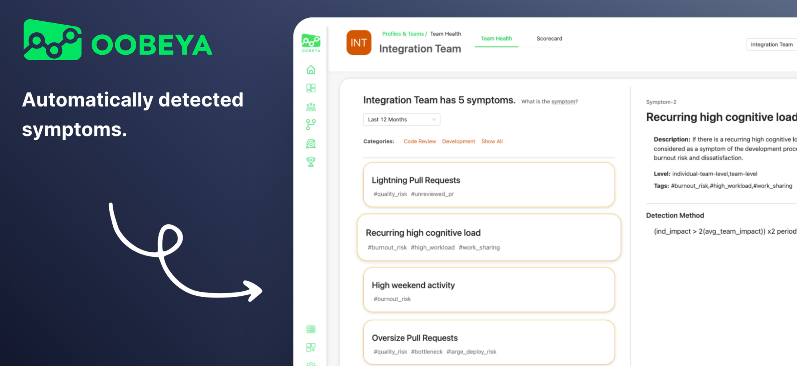
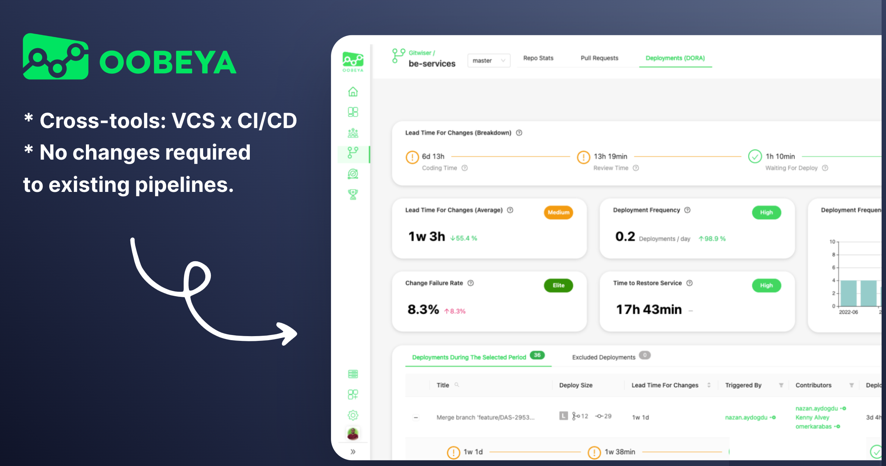

# Welcome to Oobeya!

<table data-card-size="large" data-view="cards" data-full-width="false"><thead><tr><th></th><th></th><th></th><th data-hidden data-card-target data-type="content-ref"></th></tr></thead><tbody><tr><td>🐳</td><td><strong>INSTALLATION GUIDE</strong></td><td>Learn how to install Oobeya on-premise.</td><td><a href="installations/installation-video/">installation-video</a></td></tr><tr><td>🧩</td><td><strong>INTEGRATION CATALOG</strong></td><td>View all available integrations and learn how to connect.</td><td><a href="integrations/all-integrations/">all-integrations</a></td></tr><tr><td>✅</td><td><strong>QUICK ONBOARDING GUIDE</strong></td><td>Find a step-by-step guide for your quick onboarding.</td><td><a href="getting-started/oobeya-quick-onboarding-guide.md">oobeya-quick-onboarding-guide.md</a></td></tr><tr><td>▶️</td><td><strong>PRODUCT TOUR</strong></td><td>Let's take a quick tour into Oobeya’s features.</td><td><a href="getting-started/product-tour.md">product-tour.md</a></td></tr><tr><td>👩‍⚕️</td><td><strong>SYMPTOMS CATALOG</strong></td><td>See the full list of the auto-detected Symptoms.</td><td><a href="team-insights-and-symptoms/symptoms-catalog/">symptoms-catalog</a></td></tr><tr><td>📊</td><td><strong>DORA METRICS INTRO</strong></td><td>Learn about DORA Metrics &#x26; Oobeya Deployment Analytics.</td><td><a href="deployment-analytics/dora-metrics-introduction/">dora-metrics-introduction</a></td></tr><tr><td>🏆</td><td><strong>GAMIFICATION</strong></td><td>Automatically score engineering teams based on Engineering KPIs to boost performance and motivation.</td><td><a href="gamification/gamification.md">gamification.md</a></td></tr><tr><td>📊</td><td><strong>RESOURCE ALLOCATION</strong></td><td>Gain visibility into how your engineering resources is distributed and used across projects.</td><td><a href="allocations/resource-allocation.md">resource-allocation.md</a></td></tr><tr><td>📦</td><td><strong>RELEASE NOTES</strong></td><td>Check out the new features and improvements we've released for you.</td><td><a href="https://updates.oobeya.io/">https://updates.oobeya.io/</a></td></tr><tr><td>🔐</td><td><strong>SECURITY</strong></td><td>Find details about the security policies and practices of Oobeya.</td><td><a href="https://app.gitbook.com/s/-MGIlBSTjQtZxUoFwUx4/security">SECURITY</a></td></tr></tbody></table>

***

## What is Oobeya?

[Oobeya](https://oobeya.io) is a software engineering intelligence platform that allows software development organizations to gather and analyze data from various sources to make informed decisions and optimize their development and delivery processes.

## How does Oobeya work?

Oobeya collects and analyses data from the software development, delivery, and project management processes. Oobeya utilizes this data to generate key engineering metrics like [DORA Metrics](https://oobeya.io/dora-metrics-four-key/), Cycle Time, and Agile metrics. Oobeya provides engineering leaders with data-driven, insightful reports at the individual, team, and organizational levels to empower decision-making.&#x20;

## What does Oobeya offer?

Oobeya tracks and measures common [engineering metrics](https://oobeya.io/oobeya-metric-definitions/) like Cycle Time, Lead Time, DORA metrics, and Agile metrics. However, Oobeya differentiates itself by offering a comprehensive solution to improve overall developer experience and productivity.&#x20;

Oobeya has a wide perspective and an adaptable platform, with [more than 20 SDLC tool integrations](https://oobeya.io/integrations), including SCM, CI/CD, CodeQuality, Issue Tracking, and Application Performance Monitoring tools. This enables Oobeya to offer a more comprehensive view of the software development process, allowing organizations to make more informed decisions and optimize their processes.

1. **Integrations:** 20+ SDLC integrations, including VCS, CI/CD, Code Quality, APM, Issue Tracking tools, etc. ([Integrations](https://oobeya.io/integrations/))
2. **Development Analytics:** _Git Analytics, Pull Request Analytics, Deployment Analytics_ ([**DORA Metrics**](https://oobeya.io/dora-metrics-four-key/)) – Works cross-platform to calculate accurate DORA metrics from commit to production deployment (VCS tools x CI/CD tools x APM - Incident Management tools)
3. **Profile & Team Scorecards:** Gain insights into your organization, teams, and individuals to enhance overall experience, health, productivity, and performance.
4. **Team Health / Automatically detected symptoms:** A symptom may be a recurring anti-pattern, bad practice, a bottleneck, or a roadblock in the software development and delivery processes. By identifying and addressing these symptoms, organizations can improve the overall efficiency and effectiveness of their development process.
5. **Project Analytics:** _Agile Board Analytics_ (Jira, Azure Boards)
6. **Dashboards:** Real-time customizable and adaptable dashboards (track your data from different SDLC data sources on a single page)

<figure><figcaption>
Oobeya Symptoms
</figcaption></figure>

## Oobeya DORA Metrics - Why Oobeya is the best DORA tracking tool?

Oobeya developed a mechanism for calculating [DORA Metrics](https://oobeya.io/dora-metrics-four-key/) across platforms/tools (VCS, CICD, and APM - Incident Management tools) so that any organization can accurately and effortlessly track the journey of a commit from development to production deployment.&#x20;

Furthermore, no changes to workflows or pipelines are required; Oobeya seamlessly integrates with existing tools to calculate DORA metrics.

<figure><figcaption>
Oobeya DORA Metrics
</figcaption></figure>

## DORA Metrics Blog Posts :books:

[How to Measure DORA Metrics Accurately? ](https://oobeya.io/blog/how-to-measure-dora-metrics-accurately/)

> DORA metrics are quite popular in the industry. However, working with them is extremely difficult. Let’s take a look at how your company can calculate and track DORA Metrics to gain complete visibility into complex delivery cycles.

[How To Reduce Lead Time For Changes (Optimizing DORA Metrics)](https://oobeya.io/blog/how-to-reduce-lead-time-for-changes-dora-metrics/)

> In this article, we will take a closer look at one of [DORA Metrics](https://oobeya.io/dora-metrics-four-key/), **Lead Time For Changes** (Change Lead Time), and how it can be reduced to optimize software development and delivery processes.

[DORA Metrics Tracking: How to Effectively Detect Production Failures](https://oobeya.io/blog/dora-metrics-tracking-how-to-effectively-detect-production-failures/)

> Detecting production failures is the most critical and challenging component of tracking DORA metrics. While it can be challenging, organizations can overcome these challenges by using the right tools and following best practices.

## :rocket: Let's start with Oobeya!


See Oobeya in action ---> [Oobeya Playground](https://playground.oobeya.io/)



Contact us / book your demo / start your trial ---> [Talk to us](https://oobeya.io/contact)


Learn more:


[get-started-with-oobeya.md](getting-started/get-started-with-oobeya.md)



[INSTALLATION (ON-PREMISE)](https://app.gitbook.com/s/-MGIlBSTjQtZxUoFwUx4/installations)



[ADMINISTRATION](https://app.gitbook.com/s/-MGIlBSTjQtZxUoFwUx4/administration)



[INTEGRATIONS](https://app.gitbook.com/s/-MGIlBSTjQtZxUoFwUx4/integrations)



[DEVELOPMENT ANALYTICS - GITWISER](https://app.gitbook.com/s/-MGIlBSTjQtZxUoFwUx4/gitwiser-repo-analytics)



[PROFILES ](https://app.gitbook.com/s/-MGIlBSTjQtZxUoFwUx4/scorecards)



[Project Analytics](https://app.gitbook.com/s/-MGIlBSTjQtZxUoFwUx4/project-analytics)

