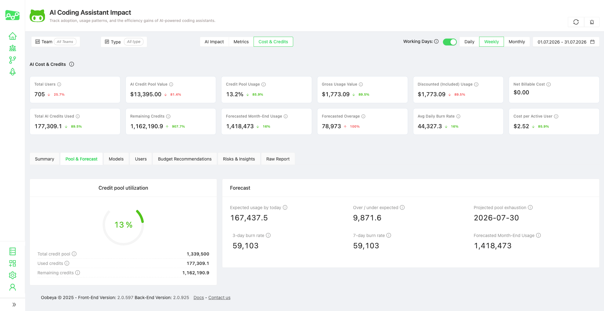

# AI Cost & Credits

### What you can track

Use this page to answer:

* How many AI Credits were consumed?
* What is the gross usage value?
* How much usage is covered by included or discounted credits?
* Is there any net billable cost?
* How much of the AI Credit pool has been used?
* Which models consume the most credits?
* Which users have the highest usage?
* Are there budget risks or unusual usage patterns?

<figure><figcaption></figcaption></figure>

***

### Accessing the page

Go to:

**AI Impact → Cost & Credits**

The page follows the same global filters as AI Impact.

<table><thead><tr><th width="245.90313720703125">Filter</th><th>Description</th></tr></thead><tbody><tr><td>Team</td><td>Filter results by all teams or a selected team</td></tr><tr><td>Type</td><td>Filter by available AI Impact type</td></tr><tr><td>Working Days</td><td>Include or exclude non-working days from calculations</td></tr><tr><td>Daily / Weekly / Monthly</td><td>Change the aggregation period</td></tr><tr><td>Date Range</td><td>Select the reporting period</td></tr></tbody></table>

***

### Summary cards

The top section gives a quick overview of AI Credit usage and cost status.

<figure><figcaption></figcaption></figure>

<table><thead><tr><th width="264.46295166015625">Card</th><th>Meaning</th></tr></thead><tbody><tr><td>Total Users</td><td>Number of users included in the selected scope</td></tr><tr><td>AI Credit Pool Value</td><td>Dollar value of the available AI Credit pool</td></tr><tr><td>Credit Pool Usage</td><td>Percentage of the available credit pool already consumed</td></tr><tr><td>Gross Usage Value</td><td>Total consumed AI Credit value before discounts or included usage</td></tr><tr><td>Discounted / Included Usage</td><td>Usage value covered by included credits or discounts</td></tr><tr><td>Net Billable Cost</td><td>Cost expected to be billed after discounts and included usage</td></tr><tr><td>Total AI Credits Used</td><td>Total AI Credits consumed in the selected period</td></tr><tr><td>Remaining Credits</td><td>Credits remaining in the available pool</td></tr><tr><td>Forecasted Month-End Usage</td><td>Estimated month-end AI Credit usage</td></tr><tr><td>Forecasted Overage</td><td>Estimated credits above the available pool</td></tr><tr><td>Avg Daily Burn Rate</td><td>Average daily AI Credit consumption</td></tr><tr><td>Cost per Active User</td><td>Gross usage value divided by active users</td></tr></tbody></table>

***

### Sections

#### 1. Summary

The Summary tab shows usage and cost trends over time.

It includes:

* Gross, included/discounted, and net billable usage trend
* Daily credit burn chart
* Latest collected report list

Use this tab to understand whether AI Credit consumption is increasing, decreasing, or spiking during the selected period.

<figure><figcaption></figcaption></figure>

#### 2. Pool & Forecast

The Pool & Forecast tab shows how much of the available AI Credit pool has been consumed and whether the current usage trend may create overage risk.

It includes:

<table><thead><tr><th width="270.619873046875">Metric</th><th>Description</th></tr></thead><tbody><tr><td>Total Credit Pool</td><td>Available AI Credit quota</td></tr><tr><td>Used Credits</td><td>Credits already consumed</td></tr><tr><td>Remaining Credits</td><td>Credits still available</td></tr><tr><td>Expected Usage by Today</td><td>Expected usage based on elapsed time in the period</td></tr><tr><td>Over / Under Expected</td><td>Difference between actual and expected usage</td></tr><tr><td>Projected Pool Exhaustion</td><td>Estimated date when the pool may be depleted</td></tr><tr><td>3-Day Burn Rate</td><td>Average usage based on the last 3 days</td></tr><tr><td>7-Day Burn Rate</td><td>Average usage based on the last 7 days</td></tr><tr><td>Forecasted Month-End Usage</td><td>Projected total usage by the end of the month</td></tr></tbody></table>

Use this tab to identify whether the organization is on track, under-consuming, or likely to exceed the available pool.

<figure><figcaption></figcaption></figure>

#### 3. Models

The Models tab breaks down AI Credit consumption by model.

It includes:

* Credit share by model
* Cost by model table
* Gross, discount, and net values per model
* User count per model
* Auto-selected model labels where available

Use this tab to identify which models are responsible for most AI Credit consumption.

<figure><figcaption></figcaption></figure>

Typical questions:

* Which model consumes the most credits?
* Are premium models driving most of the cost?
* How much usage comes from auto-selected models?
* Which models should be reviewed for optimization?

#### 4. Users

The Users tab shows user-level AI Credit consumption.

It includes:

<table><thead><tr><th width="258.610107421875">Column</th><th>Description</th></tr></thead><tbody><tr><td>User</td><td>GitHub / mapped Oobeya user</td></tr><tr><td>Credits Used</td><td>Total AI Credits consumed by the user</td></tr><tr><td>Gross Value</td><td>Consumed credit value</td></tr><tr><td>Discounted Value</td><td>Value covered by included/discounted usage</td></tr><tr><td>Net Billable Cost</td><td>Billable cost after discounts</td></tr><tr><td>Pool Impact</td><td>User share of total credit usage</td></tr><tr><td>Primary Model</td><td>Most-used model by the user</td></tr><tr><td>Models Used</td><td>Number of different models used</td></tr><tr><td>Daily Burn Rate</td><td>Average daily usage</td></tr><tr><td>Projected Month-End Credit</td><td>Estimated month-end usage</td></tr><tr><td>Status</td><td>Usage status such as Risk or Critical</td></tr></tbody></table>

Click a user to open the detail drawer.

The user detail drawer shows:

* Credits used
* Gross value
* Net billable cost
* Daily burn rate
* Projected month-end credits
* Status
* AI Credit usage timeline
* Model breakdown


User-level data should be interpreted as usage visibility, not individual performance evaluation.


#### 5. Budget Recommendations

The Budget Recommendations tab provides soft budget recommendations based on current and forecasted usage.

It includes:

<table><thead><tr><th width="280.41436767578125">Column</th><th>Description</th></tr></thead><tbody><tr><td>User</td><td>User receiving the recommendation</td></tr><tr><td>Current Budget</td><td>Current assigned AI Credit budget</td></tr><tr><td>Credits Used</td><td>Credits already consumed</td></tr><tr><td>Remaining Budget</td><td>Remaining budget amount</td></tr><tr><td>Forecasted Month-End Usage</td><td>Estimated end-of-month usage</td></tr><tr><td>Projected Increase</td><td>Expected increase above current budget</td></tr><tr><td>Recommended New Budget</td><td>Suggested adjusted budget</td></tr><tr><td>Priority</td><td>Recommendation priority</td></tr><tr><td>Reason</td><td>Explanation of the recommendation</td></tr><tr><td>Status</td><td>Current recommendation status</td></tr></tbody></table>

Budget recommendations are advisory. They help teams review usage patterns and capacity needs.

#### 6. Risks & Insights

The Risks & Insights tab highlights important usage and budget signals.

Examples include:

* Credit pool exhaustion risk
* Usage fully covered by included credits
* Users with critical usage patterns
* High-cost model concentration
* Forecasted overage risk

Risk levels may include:

* Info, Low, Medium, High, Critical

<figure><figcaption></figcaption></figure>

Use this section to quickly identify items that may require review.

#### 7.  Raw Report

The Raw Report tab displays the collected GitHub AI usage report rows.

Use this tab when you need to inspect the source-level report data behind the dashboards.

***

### Key definitions

<table><thead><tr><th width="277.8829345703125">Term</th><th>Definition</th></tr></thead><tbody><tr><td>AI Credits</td><td>Usage unit used to measure GitHub Copilot AI consumption</td></tr><tr><td>Gross Usage Value</td><td>Dollar value of consumed AI Credits before discounts</td></tr><tr><td>Discounted / Included Usage</td><td>Usage value covered by included credits or discounts</td></tr><tr><td>Net Billable Cost</td><td>Remaining cost after included usage and discounts</td></tr><tr><td>Credit Pool</td><td>Available AI Credit quota for the selected period</td></tr><tr><td>Burn Rate</td><td>Average AI Credit consumption over time</td></tr><tr><td>Forecasted Overage</td><td>Estimated usage above the available credit pool</td></tr></tbody></table>

***

### Recommended workflow

1. Start with **Summary** to understand the overall trend.
2. Open **Pool & Forecast** to check pool usage and overage risk.
3. Review **Models** to identify high-consumption models.
4. Review **Users** to understand user-level usage patterns.
5. Check **Budget Recommendations** for projected capacity needs.
6. Use **Risks & Insights** to focus on items needing attention.
7. Use **Raw Report** only when you need source-level details.
