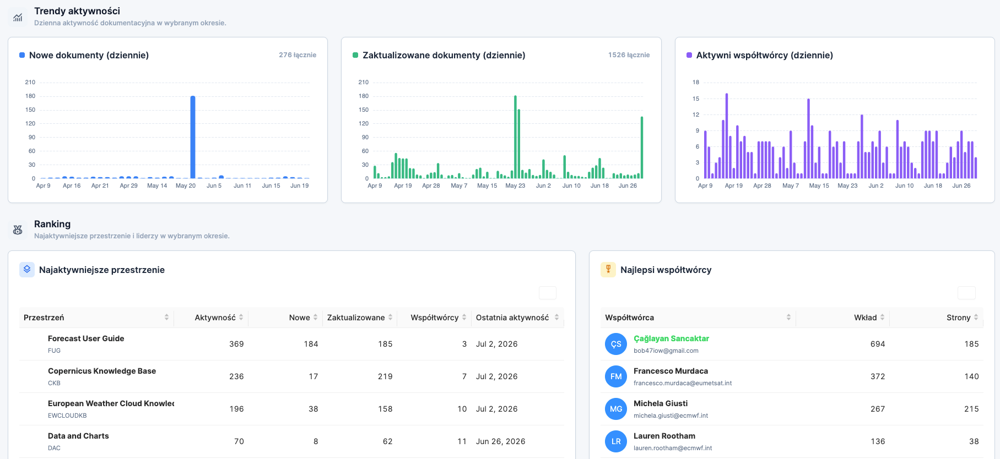
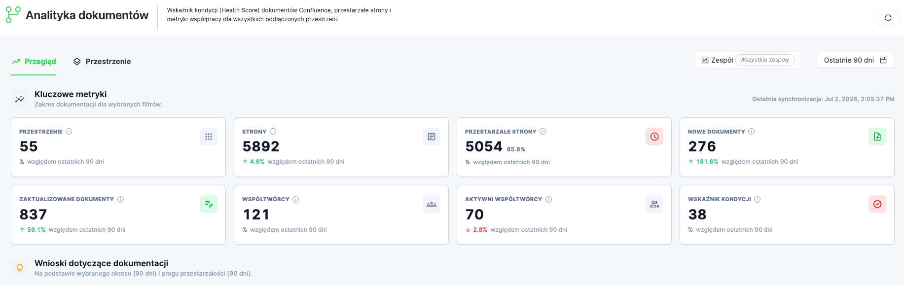
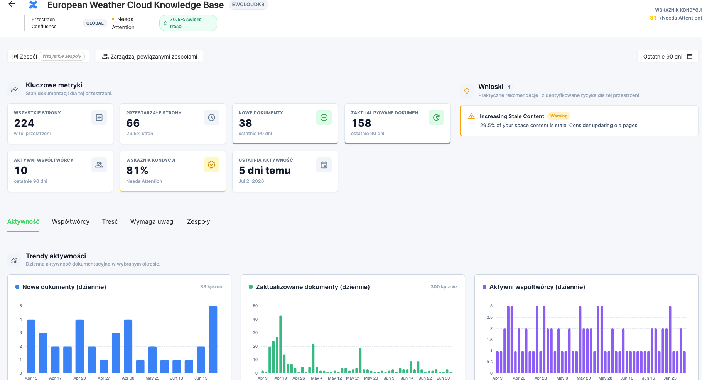

# Document Analytics (Confluence)

Document Analytics helps engineering leaders understand how Confluence documentation is created, updated, maintained, and used across connected spaces.

With this module, you can monitor documentation activity, identify stale content, review contributor activity, and understand the documentation health of each Confluence space.

Document Analytics is designed for teams that use Confluence as a knowledge base for engineering documentation, product documentation, operational guides, runbooks, onboarding pages, and team knowledge sharing.

***

### Overview

Oobeya collects metadata from connected Confluence spaces and turns it into documentation health metrics, activity trends, contributor reports, and actionable insights.

Document Analytics helps answer questions such as:

* Which Confluence spaces are actively maintained?
* How many pages are outdated or stale?
* Which teams or contributors are most active in documentation?
* Which spaces require attention?
* Which pages receive the most contributions?
* Which Confluence spaces are related to Oobeya teams?

<figure><figcaption></figcaption></figure>

***

### Accessing Document Analytics

To open Document Analytics:

1. Go to **Analytics** from the left menu.
2. Select **Document Analytics**.
3. Use the **Overview** and **Spaces** tabs to explore your Confluence documentation data.

The page includes:

* **Overview**: Organization-level documentation metrics, trends, insights, and rankings.
* **Spaces**: Space-level analysis with filters, sorting, and detailed space cards.
* **Space Details**: Detailed analysis for a selected Confluence space.

***

### Filters

Document Analytics supports filtering by team and time period.

#### Team filter

Use the **Team** filter to view documentation analytics for a specific Oobeya team.

If spaces are mapped to teams, Oobeya uses those mappings to display team-related documentation metrics.

#### Date range filter

Use the date range selector to analyze activity for a specific period, such as:

* Last 7 Days
* Last 30 Days
* Last 90 Days
* Custom date range, if enabled

The selected date range affects activity-based metrics such as:

* New documents
* Updated documents
* Active contributors
* Activity trends
* Contributor rankings

Stale content is calculated based on the configured stale threshold, typically 90 days.

***

## Overview Tab

The **Overview** tab provides a high-level summary of documentation health across all connected Confluence spaces.

<figure><figcaption></figcaption></figure>

***

### Key Metrics

The Key Metrics section summarizes the documentation footprint for the selected filters.

<table><thead><tr><th width="210.95556640625">Metric</th><th>Description</th></tr></thead><tbody><tr><td><strong>Spaces</strong></td><td>Number of connected Confluence spaces included in the analysis.</td></tr><tr><td><strong>Pages</strong></td><td>Total number of Confluence pages across the selected spaces.</td></tr><tr><td><strong>Stale Pages</strong></td><td>Pages that have not been updated within the stale threshold.</td></tr><tr><td><strong>New Docs</strong></td><td>Pages created during the selected date range.</td></tr><tr><td><strong>Updated Docs</strong></td><td>Pages updated during the selected date range.</td></tr><tr><td><strong>Contributors</strong></td><td>Total number of contributors detected in the connected spaces.</td></tr><tr><td><strong>Active Contributors</strong></td><td>Contributors who created or updated content during the selected date range.</td></tr><tr><td><strong>Health Score</strong></td><td>Overall documentation health score based on freshness, activity, and contribution signals.</td></tr></tbody></table>

Each metric card may also show a comparison against the previous period, helping you understand whether documentation activity is increasing or decreasing.

***

### Documentation Insights

The **Documentation Insights** section highlights important findings from the selected period.

Insights are automatically generated from Confluence activity and freshness data.

Examples of insights include:

* A high number of stale pages
* Spaces with a high stale content ratio
* Personal spaces with many outdated pages
* Contributor concentration risk
* Spaces with no recent activity

Each insight includes a severity level:

<table><thead><tr><th width="208.3543701171875">Severity</th><th>Meaning</th></tr></thead><tbody><tr><td><strong>Info</strong></td><td>General observation or healthy signal.</td></tr><tr><td><strong>Warning</strong></td><td>A potential documentation health issue.</td></tr><tr><td><strong>Critical</strong></td><td>A significant documentation risk that should be reviewed.</td></tr></tbody></table>

Use insights to quickly understand where attention is needed.

<figure><figcaption></figcaption></figure>

***

### Activity Trends

The Activity Trends section shows daily documentation activity for the selected period.

Available charts include:

#### 1. New Docs by Day

Shows how many new Confluence pages were created each day.

Use this chart to understand when new documentation is being produced.

#### 2. Updated Docs by Day

Shows how many pages were updated each day.

Use this chart to detect documentation maintenance patterns and spikes in update activity.

#### 3. Active Contributors by Day

Shows how many contributors were active on each day.

Use this chart to understand how broadly documentation work is distributed across contributors.

***

### Rankings

The Ranking section highlights the most active spaces and contributors.

#### Top Spaces by Activity

Shows the most active Confluence spaces based on documentation activity.

The table may include:

* Space
* Activity count
* New documents
* Updated documents
* Contributors
* Last activity date

Use this table to identify the spaces where documentation work is most active.

#### Top Contributors

Shows the contributors with the highest documentation activity.

The table may include:

* Contributor
* Email or username
* Contribution count
* Pages contributed

Use this table to understand who is contributing most to documentation.

***

## Spaces Tab

The **Spaces** tab provides a space-level view of Confluence documentation health.

Image: Document Analytics Spaces Tab

Each space card summarizes the documentation health and activity of a Confluence space.

***

### Space Cards

Each space card includes:

<table><thead><tr><th width="243.9515380859375">Field</th><th>Description</th></tr></thead><tbody><tr><td><strong>Space name</strong></td><td>Name of the Confluence space.</td></tr><tr><td><strong>Space key</strong></td><td>Short identifier of the Confluence space.</td></tr><tr><td><strong>Space type</strong></td><td>Global, personal, or archived space type, if available.</td></tr><tr><td><strong>Pages</strong></td><td>Total number of pages in the space.</td></tr><tr><td><strong>Members / Contributors</strong></td><td>Number of contributors detected for the space.</td></tr><tr><td><strong>Stale Pages</strong></td><td>Number and ratio of pages that are stale.</td></tr><tr><td><strong>Active Contributors</strong></td><td>Contributors active in the selected period.</td></tr><tr><td><strong>Health Score</strong></td><td>Documentation health score for the space.</td></tr></tbody></table>

The color of the card indicates the health status of the space:

<table><thead><tr><th width="185.76544189453125">Status</th><th>Meaning</th></tr></thead><tbody><tr><td><strong>Healthy</strong></td><td>The space has good freshness and activity signals.</td></tr><tr><td><strong>Needs Attention</strong></td><td>The space has some outdated or low-activity content.</td></tr><tr><td><strong>At Risk</strong></td><td>The space has a high stale content ratio or weak documentation health.</td></tr></tbody></table>

***

### Searching and Filtering Spaces

Use the search and filters to find specific Confluence spaces.

Available filters may include:

* Space name or key
* Team
* Space status
* Space type
* Activity level
* Health status

You can also sort spaces by:

* Number of pages
* Stale pages
* Health score
* Last activity
* Activity count

***

### Opening a Space Detail Page

Click a space card or a space row to open the **Space Detail** page.

The Space Detail page provides deeper analysis for a single Confluence space.

***

## Space Detail Page

The **Space Detail** page provides a detailed view of one Confluence space.

Image: Document Analytics Space Detail Page

Use this page to review the space’s key metrics, insights, activity trends, contributors, content, attention areas, and related Oobeya teams.

***

### Space Header

The top section shows the identity and current status of the selected space.

It includes:

* Space name
* Space key
* Space type
* Health status
* Fresh content percentage
* Health score
* Related teams count
* Date range selector
* Team filter
* Open in Confluence action, if available

***

### Key Metrics

The Key Metrics section is always visible at the top of the Space Detail page.

It includes:

<table><thead><tr><th width="218.57879638671875">Metric</th><th>Description</th></tr></thead><tbody><tr><td><strong>Total Pages</strong></td><td>Total number of pages in the selected space.</td></tr><tr><td><strong>Stale Pages</strong></td><td>Pages that have not been updated within the stale threshold.</td></tr><tr><td><strong>New Docs</strong></td><td>Pages created in the selected date range.</td></tr><tr><td><strong>Updated Docs</strong></td><td>Pages updated in the selected date range.</td></tr><tr><td><strong>Active Contributors</strong></td><td>Contributors active in the selected period.</td></tr><tr><td><strong>Health Score</strong></td><td>Documentation health score for the selected space.</td></tr><tr><td><strong>Last Activity</strong></td><td>Most recent activity detected in the space.</td></tr></tbody></table>

***

### Space Insights

The Space Insights panel appears next to the Key Metrics section.

It highlights important risks, patterns, or healthy signals for the selected space.

Examples:

* High stale content risk
* No recent activity
* Low contributor activity
* Contributor concentration
* Healthy documentation freshness
* Personal space content risk

Each insight includes:

* Title
* Message
* Severity
* Recommended action, if available

***

## Space Detail Tabs

The lower section of the Space Detail page is organized into tabs.

Available tabs include:

1. Activity
2. Contributors
3. Content
4. Needs Attention
5. Teams

***

### 1. Activity Tab

The **Activity** tab shows documentation activity trends for the selected space.

It includes:

#### New Docs by Day

Shows the number of pages created each day.

#### Updated Docs by Day

Shows the number of pages updated each day.

#### Active Contributors by Day

Shows the number of contributors active each day.

#### Freshness Distribution

Shows how pages are distributed by freshness.

Typical freshness buckets include:

* 0–30 days
* 31–60 days
* 61–90 days
* 90+ days

Use this chart to understand how much of the space content is fresh or outdated.

#### Contribution by Person

Shows how documentation contribution is distributed across contributors.

Use this chart to identify whether documentation work is shared across the team or concentrated in a small group of people.

***

### 2. Contributors Tab

The **Contributors** tab shows person-level documentation metrics for the selected space.

The contributors table may include:

<table><thead><tr><th width="247.47869873046875">Column</th><th>Description</th></tr></thead><tbody><tr><td><strong>Contributor</strong></td><td>Name of the contributor.</td></tr><tr><td><strong>Email / Username</strong></td><td>Contributor identifier from Confluence.</td></tr><tr><td><strong>Contributions</strong></td><td>Total contribution count in the selected period.</td></tr><tr><td><strong>Pages</strong></td><td>Number of pages the contributor worked on.</td></tr><tr><td><strong>Created Docs</strong></td><td>Number of pages created, if available.</td></tr><tr><td><strong>Updated Docs</strong></td><td>Number of pages updated, if available.</td></tr><tr><td><strong>Comments</strong></td><td>Number of comments, if available.</td></tr><tr><td><strong>Last Activity</strong></td><td>Most recent activity date.</td></tr><tr><td><strong>Mapped Oobeya User</strong></td><td>Matched Oobeya user, if available.</td></tr><tr><td><strong>Mapped Team</strong></td><td>Related Oobeya team, if available.</td></tr></tbody></table>

Use this tab to understand who maintains the space and whether documentation activity is distributed across contributors.

***

### 3. Content Tab

The **Content** tab shows page-level documentation activity.

It includes two views:

* Most Contributed Content
* Recently Updated Content

#### Most Contributed Content

Shows pages that received the most contribution or activity.

The table may include:

<table><thead><tr><th width="249.845947265625">Column</th><th>Description</th></tr></thead><tbody><tr><td><strong>Page Title</strong></td><td>Title of the Confluence page.</td></tr><tr><td><strong>Created By</strong></td><td>User who created the page.</td></tr><tr><td><strong>Last Updated By</strong></td><td>User who last updated the page.</td></tr><tr><td><strong>Last Updated</strong></td><td>Last update date.</td></tr><tr><td><strong>Versions</strong></td><td>Number of versions or updates.</td></tr><tr><td><strong>Contributors</strong></td><td>Number of contributors.</td></tr><tr><td><strong>Comments</strong></td><td>Number of comments, if available.</td></tr><tr><td><strong>Open in Confluence</strong></td><td>Opens the original page in Confluence.</td></tr></tbody></table>

Use this view to find the most actively maintained or frequently changed pages.

#### Recently Updated Content

Shows the most recently updated pages in the space.

Use this view to quickly review the latest documentation changes.

***

### 4. Needs Attention Tab

The **Needs Attention** tab highlights pages that may require review.

Pages may appear here for reasons such as:

* Stale content
* Not updated in 90+ days
* Low quality score
* Low collaboration
* No recent activity
* Personal space content risk
* High historical activity but no recent updates

The table may include:

<table><thead><tr><th width="240.8895263671875">Column</th><th>Description</th></tr></thead><tbody><tr><td><strong>Page Title</strong></td><td>Title of the Confluence page.</td></tr><tr><td><strong>Reason</strong></td><td>Why the page requires attention.</td></tr><tr><td><strong>Created By</strong></td><td>User who created the page.</td></tr><tr><td><strong>Last Updated By</strong></td><td>User who last updated the page.</td></tr><tr><td><strong>Last Updated</strong></td><td>Last update date.</td></tr><tr><td><strong>Versions</strong></td><td>Number of versions or updates.</td></tr><tr><td><strong>Contributors</strong></td><td>Number of contributors.</td></tr><tr><td><strong>Quality Score</strong></td><td>Page-level quality score, if available.</td></tr><tr><td><strong>Open in Confluence</strong></td><td>Opens the original page in Confluence.</td></tr></tbody></table>

Use this tab to prioritize documentation cleanup and maintenance.

***

### 5. Teams Tab

The **Teams** tab shows which Oobeya teams are related to the selected Confluence space.

Image: Related Teams Mapping

You can use this tab to manage the relationship between Confluence spaces and Oobeya teams.

#### Related Teams

Mapped teams are displayed as chips or cards.

If no teams are mapped, Oobeya shows:

> No teams mapped to this space yet.

#### Add a Team Mapping

To add a related team:

1. Open the **Teams** tab.
2. Click **Add Team**.
3. Search for the Oobeya team.
4. Select the team.
5. Save the mapping.

After the mapping is added, the Confluence space is associated with the selected Oobeya team.

#### Remove a Team Mapping

To remove a team mapping:

1. Open the **Teams** tab.
2. Find the mapped team.
3. Click the remove action.
4. Confirm the change, if required.

Removing a mapping does not delete the team or Confluence space. It only removes the relationship between them.

***

## Health Score

The Health Score represents the documentation health of a space or the overall documentation environment.

The score is based on signals such as:

* Content freshness
* Stale page ratio
* Documentation activity
* Contributor activity
* Collaboration distribution

A higher score means the space is healthier and better maintained.

<table><thead><tr><th width="253.879150390625">Score Range</th><th>Status</th></tr></thead><tbody><tr><td><strong>High</strong></td><td>Healthy</td></tr><tr><td><strong>Medium</strong></td><td>Needs Attention</td></tr><tr><td><strong>Low</strong></td><td>At Risk</td></tr></tbody></table>

The exact score thresholds may vary depending on your Oobeya configuration.

***

## Stale Pages

A stale page is a Confluence page that has not been updated within the configured stale threshold.

The default threshold is commonly 90 days.

For example, if the stale threshold is 90 days, a page last updated more than 90 days ago is counted as stale.

Stale pages are important because outdated documentation can create operational risk, onboarding friction, and knowledge gaps.

***

## Fresh Content

Fresh content refers to pages updated within the configured freshness period.

The fresh content percentage shows how much of a space is considered current.

For example:

> 70% fresh content

means that 70% of the pages in the selected space are considered up to date based on the freshness threshold.

***

## Contributor Metrics

Contributor metrics show how documentation work is distributed across people.

Oobeya can show:

* Total contributors
* Active contributors
* Top contributors
* Contribution count
* Pages contributed
* Last activity
* Contributor concentration

Contributor concentration helps identify whether most documentation work is handled by a small number of people.

High concentration may indicate knowledge ownership risk.

***

## Team Mapping

Team mapping connects Confluence spaces to Oobeya teams.

This helps Oobeya show documentation metrics in a team context.

For example, if the **Platform Engineering** team owns a Confluence space, you can map that space to the corresponding Oobeya team.

After mapping, team-based filters and reports can include the related documentation data.

### Recommended mapping approach

Use space-to-team mapping when a Confluence space clearly belongs to a team, product, or engineering area.

A space can be related to more than one team if ownership is shared.

***

## Common Use Cases

### 1. Identify outdated documentation

Use the Overview or Spaces tab to find spaces with a high stale page ratio.

Then open the Space Detail page and review the Needs Attention tab.

### 2. Review documentation activity

Use Activity Trends to see whether teams are creating and updating documentation regularly.

### 3. Find documentation owners and contributors

Use the Contributors tab to understand who maintains a space and how contributions are distributed.

### 4. Prioritize documentation cleanup

Use the Needs Attention tab to identify pages that should be reviewed, updated, archived, or reassigned.

### 5. Connect documentation to teams

Use the Teams tab to map Confluence spaces to Oobeya teams.

This helps engineering leaders analyze documentation health by team.

***

## Best Practices

To get the most value from Document Analytics:

1. Map important Confluence spaces to Oobeya teams.
2. Review stale spaces regularly.
3. Use the Needs Attention tab to prioritize documentation updates.
4. Monitor contributor concentration to avoid knowledge silos.
5. Keep onboarding, runbook, architecture, and operational documents up to date.
6. Review personal spaces separately from team-owned spaces when possible.
7. Use the date range filter to compare documentation activity across periods.
