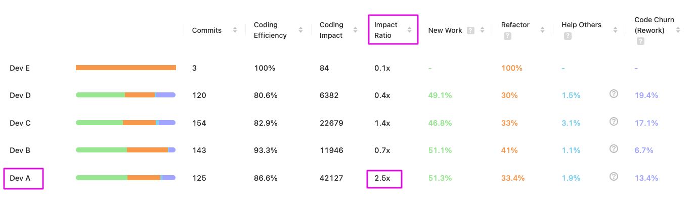

# Impact Ratio (team-level)

## Impact Ratio Metric

The Impact Ratio metric in Oobeya measures the relative contribution of an individual developer compared to the team's average impact. This metric helps answer significant questions:

1. How does **an individual developer's cognitive load** compare to the **team's average**?
2. Are there significant **imbalances in contributions within the team**?


Before reading this guide, check out the [Coding Impact Score](coding-impact-score.md) metric.


***

### Calculation

The Impact Ratio is calculated using the following formula:

```

Impact Ratio = Total Impact Score of a Developer / Avg Team Impact Score 

```

#### Factors Considered:

* **Total Impact Score of a Developer:** The sum of the Coding Impact Scores of all contributions (commits) for a developer within the given period.
* **Avg Team Impact Score:** The average Coding Impact Score of the team, calculated by dividing the total team impact score by the number of active contributors.


<figure><figcaption><p>Coding Impact Score &#x26; Impact Ratio</p></figcaption></figure>

***

### Why It Matters

Tracking the Impact Ratio allows Oobeya to identify the relative cognitive load and contribution of individual developers compared to the team average. This is crucial for recognizing:

* **Individual Health Symptoms:** The risk of certain developers being overburdened compared to their peers.
* **Work Distribution and Collaboration Symptoms:** Potential imbalances in work distribution that could affect team dynamics and efficiency.

***

### How to Use It

While an Impact Ratio higher or lower than 1.0 isn't inherently positive or negative, it provides insights into individual contributions, workload balance, and knowledge silos. Here's how you can use it effectively:

#### Balance Workload Within The Team:

* **Monitor Ratios:** Regularly track the Impact Ratios to identify developers who are significantly above or below the team average.
* **Redistribute Tasks:** Adjust task assignments to ensure a more balanced workload, preventing burnout and promoting sustainable productivity.

#### Improve Processes:

* **Analyze Patterns:** Examine patterns in Impact Ratios to identify areas where process improvements can help balance workloads and share the knowledge among team members.
* **Implement Changes:** Introduce changes to streamline workflows, enhance collaboration, and boost efficiency, ensuring a more equitable distribution of cognitive load.

***

### An Example To Better Understand The Impact Ratio

Consider the following example:

* **Developer A:** Has a total impact score of 120x.
* **Team:** Consists of 4 developers with individual impact scores of 40x, 120x, 30x, and 10x.
* **Total Team Impact Score:** 40x + 120x + 30x + 10x = 200x
* **Avg Team Impact Score:** 200x / 4 = 50x

#### Calculation:

* **Impact Ratio of Developer A:** 120x / 50x = 2.4


#### Result:

Developer A has an Impact Ratio of 2.4, indicating that their cognitive load and contribution are significantly above the team average. This could be a sign that Developer A is taking on more complex or critical tasks, or it might indicate a need to rebalance workload within the team.


***

### Conclusion

The Impact Ratio is a powerful tool in Oobeya's suite, providing valuable insights into the relative contributions and cognitive load of individual developers. By using it to balance workloads, recognize contributions, break down knowledge silos, and improve processes, you can support the well-being and productivity of your team, ensuring sustainable, efficient, and productive development cycles.
