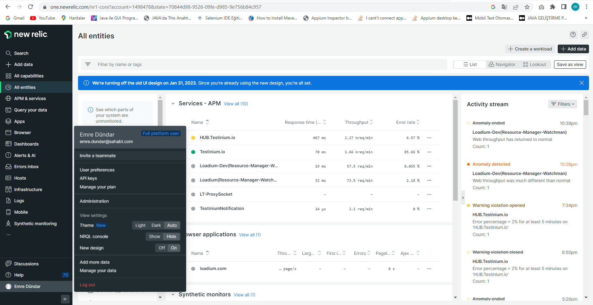
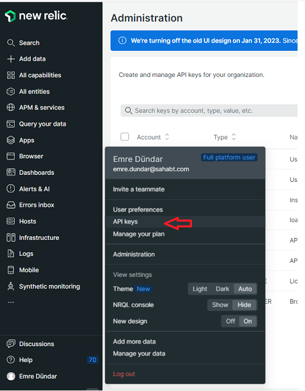

# New Relic Integration

## 1. **Create An API Key on New Relic** :tools:&#x20;

1. Click the **"Profile"** button as in the figure.

.png>)

2\. Click the **"API Keys"** button.

3. Click the "Create a key" button.

<figure><figcaption></figcaption></figure>

4. Select the account and click the "Create a key" button to create the API key.

<figure><figcaption></figcaption></figure>

## 2. Creating A Query Key on New Relic Insights

1. Click the **"Profile"** button as in the figure.&#x20;

<figure><figcaption></figcaption></figure>

2\. Click the "**API Keys**" button.&#x20;

<figure><figcaption></figcaption></figure>

3\. Click on the **"Insights Query Keys”** button.

<figure><figcaption></figcaption></figure>

4. Click the add icon next to the **"Query Keys"** to add a query key.

<figure><figcaption></figcaption></figure>

5. You can use the created query key as shown below to add a data source in Oobeya.

## 4. Install New Relic Addon on Oobeya :jigsaw:&#x20;

1. Log in to [Oobeya](https://oobeya.io/) with an Administrator account.&#x20;
2. Navigate to **Market Place**, select the New Relic addon, and click the "Install" button.&#x20;

## 3. Add A New Data Source :electric\_plug:&#x20;

1. Navigate to **Data Sources**, and select New Relic to add a new data source.&#x20;

2\. Click the "**New Data Source**" button and fill in the form. _API Token_ from Step-1 and _Query Key_ from Step-2.&#x20;

3\. Click the "**Test Connection**" button to verify the connection.&#x20;

## Ready to Connect :rocket:&#x20;

Now Oobeya is connected with your own New Relic account to track the real-time and average performance metrics.&#x20;

## **Next Steps** :dart:&#x20;

* [Add a new Widget](../../../dashboards/adding-a-new-widget.md)
