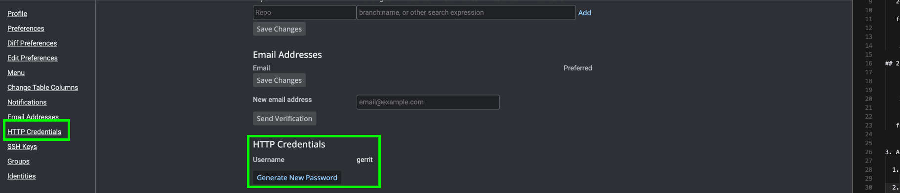

# Gerrit Integration

This guide provides a step-by-step walkthrough to integrate your **Gerrit** code review system with **Oobeya** to track engineering metrics and DORA analytics.

***

### 1. Create Gerrit HTTP Credentials 🔑

To allow Oobeya to access your Gerrit repositories, you need to generate an HTTP access token.

1. **Access Settings:** Click the user icon in the top-right corner of your Gerrit UI, navigate to **Settings**.
2. **Generate Token:** Open the **"HTTP Credentials"** tab on the left sidebar and click the **"Generate New Password"** button.

<figure><figcaption></figcaption></figure>

3. **Secure Your Password:** Copy and save the generated password immediately. You will need this for the Oobeya data source configuration.

***

### 2. Install Gerrit Add-on on Oobeya 🧩

Before connecting your data, ensure the Gerrit integration is active in your Oobeya instance.

1. Log in to **Oobeya** with an **Administrator** account.
2. Navigate to **Integrations** from the side menu.
3. Locate the **Gerrit** add-on and click the **"Install"** button.

<figure><figcaption></figcaption></figure>

***

### 3. Add A New Data Source 🔌

Now, connect your Gerrit server to start fetching data.

1. Navigate to **Data Sources** and select **Gerrit** from the SCM & CI/CD category.

<figure><figcaption></figcaption></figure>

2. Click the **"New Data Source"** button and fill in the required fields:

* **Server URL:** Your Gerrit instance URL (e.g., `https://gerrit.yourdomain.com`).
* **Username:** Your Gerrit username.
* **Token:** The **HTTP Password** you generated in Step 1.

<figure><figcaption></figcaption></figure>

3. Click **"Test Connection"** to verify the credentials.
4. Once verified, click **"Add"** to finalize the setup.

***

### Ready to Connect 🚀

**Congratulations!** Oobeya is now connected to your Gerrit server. It will begin pulling real-time statistics from your repositories to track development velocity, code review cycles, and team performance.
