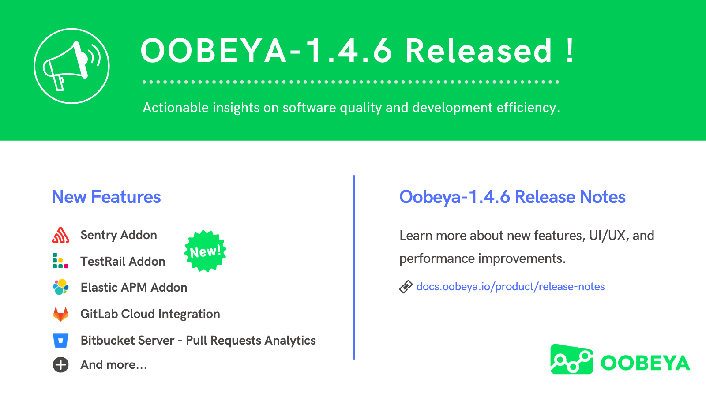

# OOBEYA-1.4.6

## OOBEYA-1.4.6 - _Elastic APM / TestRail / Sentry Addons, Git Analytics for GitLab Cloud & Bitbucket Server..._

We have implemented changes to improve your experience with Oobeya. _See all the changes live in Oobeya Playground..._  :point\_right: [_Go to Playground_](https://playground.oobeya.io/)

### :new: NEW FEATURES

**TestRail Addon (Test & QA)** :jigsaw: \
We've just released the TestRail Addon on Oobeya Market Place. You can monitor test execution reports on Oobeya Dashboards now. Learn how to integrate Oobeya with your TestRail account [here](../../integrations/all-integrations/code-quality-addons/testrail-integration.md)[.](https://docs.oobeya.io/integrations/apm-monitoring-addons/sentry-integration)

**Sentry Addon (APM)** :jigsaw: \
We've released the Sentry Addon on Oobeya Market Place. You can track Sentry issues on Oobeya Dashboards now. Learn how to integrate Oobeya with your Sentry account [here](../../integrations/all-integrations/apm-monitoring-addons/sentry-integration.md)[.](https://docs.oobeya.io/integrations/apm-monitoring-addons/sentry-integration)

**Elastic APM Addon (APM)** :jigsaw: \
We've released the Elastic APM Addon on Oobeya Market Place. You can monitor APM metrics on Oobeya Dashboards now.&#x20;

**Table/List Widget For Custom Addons** :bookmark\_tabs: \
We've added a new widget type for Custom Addon development. Now you can create table widgets with your custom addons. Learn how to develop a custom addon [here](https://github.com/dashboardqa/custom-addon-template).

**New Relic Transactions Widget** :bar\_chart: \
We've added a new predefined widget (Top Web Transactions by # of calls) for New Relic Addon. You can list your web transactions by the number of calls. Learn how to integrate Oobeya with your New Relic account [here](../../integrations/all-integrations/apm-monitoring-addons/new-relic-integration.md)[.](https://docs.oobeya.io/integrations/apm-monitoring-addons/sentry-integration)

**GitLab Cloud Integration** :electric\_plug: \
We already had an integration with [GitLab Enterprise](../../integrations/all-integrations/scm-addons/gitlab-addon.md). We now also support integration with GitLab Cloud. You can add your gitlab.com account as a GitLab [data source](../../integrations/adding-new-integration/adding-a-new-data-source.md) on Oobeya to[ analyze your GitLab repos](/broken/pages/-MGIrMC8EqiUIlw9lI0P).&#x20;

**Pull Requests Analytics for Bitbucket Server** :electric\_plug: \
We are ready to analyze pull requests on Bitbucket Server after Bitbucket Cloud, GitHub, GitLab, Azure DevOps Server & Cloud. You can [analyze Bitbucket Server repositories](/broken/pages/-MGIrMC8EqiUIlw9lI0P) now to improve code review workflow and to reduce cycle time.

**Amazon DocumentDB Support** :handshake: \
Now we officially support Amazon DocumentDB as a database. Learn more about Amazon DocumentDB [here](https://aws.amazon.com/documentdb/).

### :muscle: IMPROVEMENTS

**Design improvements For UX** :cherry\_blossom: \
We've performed responsive design improvements on Jira Issues widget, Individual, and Team Scorecards.

**Account Session Timeout & Account Lockout** :lock: \
We've added session timeout and account lockout features to improve security on Oobeya.

**Duplicate Analysis Check on Gitwiser** \
We started checking repo/branch selection (Git) and path (for SVN, TFVC) to avoid duplicate analysis on Gitwiser.

### :lady\_beetle: FIXES

* [x] Fixed crash on Scorecards and Executive Dashboard when Sonarqube API returns an error message if response count is more than 10k.
* [x] Fixed update problem of data sources when the API Token field (optional) was set as empty.
* [x] Fixed issue on Custom Addon when the API Token field (optional) was set as empty.
* [x] Fixed problem of searching for child items.
* [x] Fixed code quality drawer listing & sorting issues on Executive Dashboard.
* [x] Fixed issue while showing the display name of custom addons.
