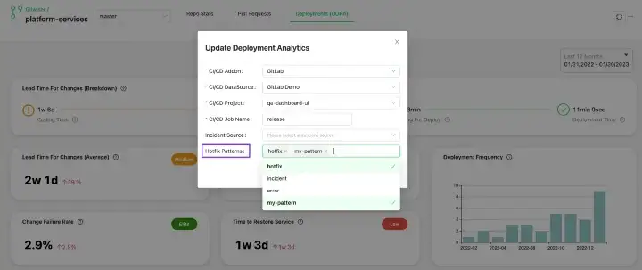
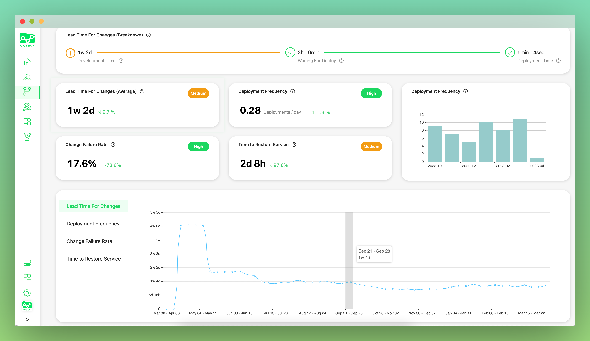

# 🎁 Oobeya 2023 Q1 - Release Notes

&#x20;:tada: We are super excited to share our new features and improvements with you!

## ​🎁 NEW FEATURES - TOP 10

1. [Oobeya Team Health \[BETA\] - Autodetected Symptoms](oobeya-2023-q1-release-notes.md#1-oobeya-team-health-beta-autodetected-symptoms)
2. [Bulk User Import From LDAP](oobeya-2023-q1-release-notes.md#2-bulk-user-import-from-ldap)
3. [LDAP User Sync Button](oobeya-2023-q1-release-notes.md#3-ldap-user-sync-button)
4. [Oobeya  OKTA Integration](oobeya-2023-q1-release-notes.md#4-oobeya-okta-integration)
5. [Oobeya  Veracode Integration](oobeya-2023-q1-release-notes.md#5-oobeya-veracode-integration)
6. [DORA - Tracking New Relic Incidents](oobeya-2023-q1-release-notes.md#6-tracking-new-relic-incidents-to-detect-production-failures-automatically-for-dora-metrics-calculat) to Detect Production Failures Automatically for DORA Metrics Calculation
7. [DORA - Identifying Hotfix Naming Patterns ](oobeya-2023-q1-release-notes.md#7-identifying-hotfix-naming-patterns-to-detect-production-failures-automatically-for-dora-metrics-ca)to Detect Production Failures Automatically for DORA Metrics Calculation
8. [DORA Metrics Trends In A Timeline View](oobeya-2023-q1-release-notes.md#8-dora-metrics-trends-in-a-timeline-view)
9. [Identifying Reverts and Calculating Pull Request Revert Rate](oobeya-2023-q1-release-notes.md#9-identifying-reverts-and-calculating-pull-request-revert-rate)
10. [Individual Scorecards Feature on/off Toggle](oobeya-2023-q1-release-notes.md#10-individual-scorecards-feature-on-off-toggle)

### **#1** Oobeya Team Health \[BETA] - Autodetected Symptoms

The [Oobeya Symptoms](../../team-insights-and-symptoms/symptoms-catalog/) module is a powerful tool for detecting and addressing problems in software development and delivery processes. By collecting and analyzing data from a variety of sources, the module is able to identify and alert teams to issues such as recurring anti-patterns, bad practices, and bottlenecks.

The Oobeya Symptoms module includes the following features:

* Identification of patterns and trends that may indicate problems or inefficiencies
* Recommendations for addressing detected issues

<table><thead><tr><th width="99.33333333333331">No #</th><th>Smyptom</th><th>Symptom Source</th></tr></thead><tbody><tr><td>S1</td><td><a href="../../team-insights-and-symptoms/symptoms-catalog/s1-recurring-high-rework-rate.md">Recurring high rework rate</a></td><td>Gitwiser - Git Analytics (VCS tools)</td></tr><tr><td>S2</td><td><a href="../../team-insights-and-symptoms/symptoms-catalog/s2-recurring-high-cognitive-load.md">Recurring high cognitive load</a></td><td>Gitwiser - Git Analytics (VCS tools)</td></tr><tr><td>S3</td><td><a href="../../team-insights-and-symptoms/symptoms-catalog/s3-high-weekend-activity.md">High weekend activity</a></td><td>Gitwiser - Git Analytics (VCS tools)</td></tr><tr><td>S6</td><td><a href="../../team-insights-and-symptoms/symptoms-catalog/s6-high-technical-debt-on-sonar.md">High technical debt on Sonar</a></td><td>Sonar</td></tr><tr><td>S7</td><td><a href="../../team-insights-and-symptoms/symptoms-catalog/s7-high-vulnerabilities-on-sonar.md">High vulnerabilities on Sonar</a></td><td>Sonar</td></tr><tr><td>S8</td><td><a href="../../team-insights-and-symptoms/symptoms-catalog/s8-high-code-quality-bugs-on-sonar.md">High code quality bugs on Sonar</a></td><td>Sonar</td></tr><tr><td>S9</td><td><a href="../../team-insights-and-symptoms/symptoms-catalog/s9-unreviewed-pull-requests.md">Unreviewed Pull Requests</a></td><td>Gitwiser - PR Analytics (VCS tools)</td></tr><tr><td>S10</td><td><a href="../../team-insights-and-symptoms/symptoms-catalog/s10-lightning-pull-requests.md">Lightning Pull Requests</a></td><td>Gitwiser - PR Analytics (VCS tools)</td></tr><tr><td>S11</td><td><a href="../../team-insights-and-symptoms/symptoms-catalog/s11-oversize-pull-requests.md">Oversize Pull Requests</a></td><td>Gitwiser - PR Analytics (VCS tools)</td></tr></tbody></table>

#### Oobeya Symptom Catalog

Each symptom includes a description, potential complications, possible causes, improvement areas, and a detection method.&#x20;

<figure><figcaption>
Oobeya Symptoms
</figcaption></figure>

### **#2 Bulk User Import From LDAP**

As an enterprise-grade solution, we understand the importance of providing users with a seamless experience. No matter your organization's size, we know that managing users can be a cumbersome and time-consuming process. That's why we are excited to introduce our new LDAP Bulk User Import feature to manage users easier and faster.&#x20;

The LDAP Bulk User Import feature allows users to quickly import large groups of users into their Oobeya account. This saves time and makes it easier to keep your user base up-to-date. This feature also ensures that user accounts are secure and compliant with your organizational protocols.&#x20;

We hope this feature provides our customers with an improved user experience and helps to reduce the time needed to onboard new users. We are committed to continuing to improve Oobeya and provide our customers with the best possible user experience.&#x20;

If you have any questions about using LDAP Bulk User Import, please reach out to us and one of our team members will be happy to help.

### #3 LDAP User Sync Button

The LDAP User Sync button and functionality allow you to quickly and easily synchronize your user list with your LDAP directory. This means that when a user is deleted from the LDAP directory, her/his account will be deleted (deactivated) from Oobeya automatically. This helps ensure that only valid users have access to your Oobeya system, improving security and reducing the time it takes to maintain your user list.

The best part is that the LDAP User Sync button can be scheduled to run automatically, so you don’t have to worry about manually updating your user list. This is a great time saver for busy administrators and teams.

We hope you enjoy the new LDAP User Sync feature and find it helpful in keeping your user list up-to-date and secure. As always, if you have any questions or feedback, please don’t hesitate to contact us.

### #4 Oobeya OKTA Integration

We’re pleased to announce that Oobeya is now integrated with OKTA! This new feature makes it easier for OKTA users to manage user identity, access, and authentication.

[OKTA](https://www.okta.com/) is a cloud-based identity and access management platform that offers secure single sign-on (SSO) and automated user provisioning. By integrating Oobeya with OKTA, users can now access the system securely and quickly.

The integration with OKTA also provides support for SAML-based authentication. [SAML (Security Assertion Markup Language)](https://developer.okta.com/docs/concepts/saml/) is a popular protocol for web-based SSO that provides a secure way for users to securely access multiple applications with a single set of credentials.

In addition to the improved security, the integration with OKTA streamlines the user experience. With OKTA, users can access Oobeya as other applications with one click. This makes it easier than ever to access the Oobeya platform and manage user identity and authentication.

If you have any questions or need help getting started, don't hesitate to contact our support team.

### **#5 Oobeya Veracode** Integration

We are excited to announce the integration of [Oobeya](https://oobeya.io) with [Veracode](https://www.veracode.com/), a leading application security platform. As a software engineering intelligence platform, we aim to increase the number of our integrations to give our customers more visibility into their software development and delivery cycles.&#x20;

The new integration will provide Oobeya customers with enhanced visibility into their application security posture, allowing them to identify and address security risks quickly and effectively. It will also enable customers to streamline their application security processes.&#x20;

We understand the importance of security and are committed to helping our customers stay ahead of the threats posed by malicious actors. The Veracode integration is the latest step we’re taking to ensure that our customers have the best tools available to protect their applications.&#x20;

<figure><figcaption>
Oobeya Veracode Integration
</figcaption></figure>

#### **Oobeya Team Health & Veracode integration**&#x20;

With Oobeya, engineering leaders can get valuable insights into their development teams and improve the developer experience and team health. The Team Health module is designed to address both technical and cultural aspects of the development and delivery processes, providing a holistic approach to optimizing team performance in software development.&#x20;

The Team Health module is comprised of two main components: Team Symptoms and Team Scorecard. Team Symptoms provides a visual representation of team health, highlighting potential areas for improvement and addressing the root causes of team dysfunctions. Team Scorecard, on the other hand, provides a quantitative assessment of team performance, measuring key metrics such as lead time, code review, code quality, and DORA metrics. **Now, + Veracode security metrics!**


:bulb: Read more on Oobeya Blog: [Optimizing Team Performance in Software Development with Oobeya Team Health Module](https://oobeya.io/blog/optimizing-team-performance-in-software-development/)


### #6 Tracking New Relic Incidents to Detect Production Failures Automatically for DORA Metrics Calculation

We’re excited to announce the release of our newest feature for Oobeya: tracking New Relic incidents to detect production failures automatically for [DORA Metrics](https://oobeya.io/dora-metrics) calculation. With our new feature, customers can quickly and easily track production failures and calculate their Change Failure Rate without any effort.

With Oobeya, you can now connect and track New Relic incidents to detect production failures automatically and more accurately calculate your DORA Metrics, such as the Change Failure Rate (CFR) and Mean Time To Restore Service (MTTR). This new feature helps streamline the process of measuring your DORA Metrics, saving you time and effort.

To get started, simply connect your New Relic account to Oobeya, select your New Relic application in the Gitwiser Deployments (DORA) behind your repository + CICD pipeline, and the rest is taken care of automatically.&#x20;


:bulb: Read more on Oobeya Blog: [DORA Metrics Tracking: How to Effectively Detect Production Failures](https://oobeya.io/blog/dora-metrics-tracking-how-to-effectively-detect-production-failures/)


### #7 Identifying Hotfix Naming Patterns to Detect Production Failures Automatically for DORA Metrics Calculation

Oobeya can now identify hotfix naming patterns to detect production failures automatically for DORA metrics. With this update, Oobeya can now automatically detect production failures by analyzing your git branch naming conventions.

To identify hotfix deployments, Oobeya looks for naming patterns in the branch name, Pull Request title, and deployment title. Because hotfix deployments are used to fix critical production issues, Oobeya sets the health status of previous deployments to Failure.

This new feature provides teams with an efficient and automated way of tracking their CFR, as well as other DORA metrics.

<figure><figcaption>
Hotfix Pattern Detection
</figcaption></figure>

### #8 DORA Metrics Trends In A Timeline View

With this new feature, you can now view and compare your team’s performance over time with a timeline that shows trends in your data over time. Through this timeline, you can see how you have improved since the previous version of yourself, and benchmark your progress in comparison. You can view trends over longer periods of time, helping you to make better decisions about where your team needs to go next.

<figure><figcaption>
DORA Metrics Trends
</figcaption></figure>

### #9 Identifying Reverts and Calculating Pull Request Revert Rate

Oobeya's Pull Request Analytics module now can identify pull request reverts and calculate the pull request revert rate at the team level.

This feature is designed to help teams track their development processes more efficiently and accurately. The new feature allows users to track their pull request revert rate, which is a key indicator of the effectiveness of their development process. This helps teams identify areas that need to be improved.

We’re thrilled to offer this new feature to our users and hope it helps them further refine their processes.

### #10 Individual Scorecards Feature on/off Toggle

Oobeya Scorecards allow organizations to gather and track engineering metrics and activities in different dimensions and levels. The Individual Scorecard allows team members to see where they need improvement and identify pending tasks and open issues that require action.&#x20;

On the other hand, we know some organizations do not prefer to make metrics and activities visible at the individual level. Administrators can enable or disable Individual Scorecards for their organizations by using this toggle. By accessing the Oobeya admin panel, admins now have the ability to toggle the individual scorecards feature on and off, giving them the flexibility to customize their experience with the platform.

<figure><figcaption></figcaption></figure>

## :muscle: IMPROVEMENTS

* \[Gitwiser] Started to show the list of the running/pending/cloning analyses.
* \[TeamScorecard] Added a technology/language filter for code quality (Sonarqube, SonarCloud) widgets.
* \[TeamScorecard] Added multiple data source selection functionality for Sonar addon.
* \[Admin] Added a "Test Connection" button to the LDAP configuration page.
* Performance improvements (Pull request analysis, DORA analysis, Symptom detection, and more...)
* UI/UX improvements (navigating to external tools, design enhancements, new descriptions and tooltips, and more...)

## :person\_running: SEE OOBEYA IN ACTION!


Do you want to see all the new features in action and talk about the product roadmap?

Click and [**book a demo**](https://oobeya.io/schedule-a-new-demo/?utm_source=releasenotes\&utm_medium=june2022) now.


