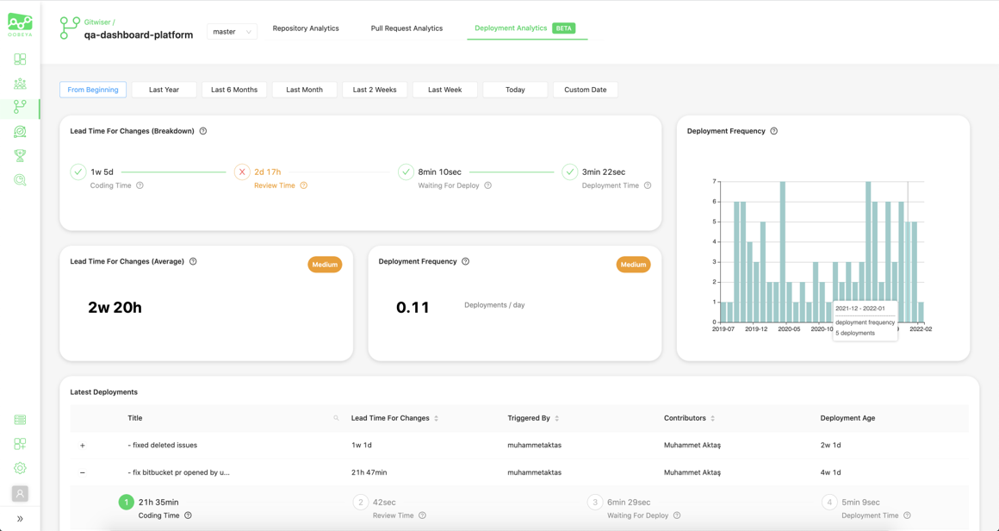
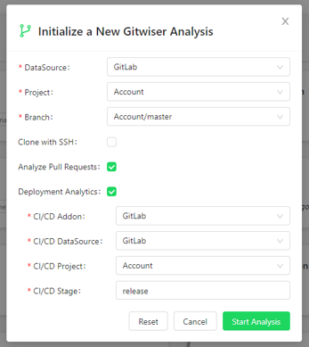

# 🎁 Oobeya Feb 2022 Updates

:tada: We are excited to introduce our new features and improvements.

### \[BETA] Deployment Analytics (DORA Metrics)&#x20;

We have started developing the "Deployment Analytics" feature to evaluate [DORA metrics](https://cloud.google.com/blog/products/devops-sre/using-the-four-keys-to-measure-your-devops-performance) (Four key metrics).

For the BETA release, you can now calculate two of the DORA metrics for your deployments:

1. **Deployment Frequency**—How often an organization successfully releases to production
2. **Lead Time for Changes**—The amount of time it takes a commit to get into production

.png>)

What we deliver in the BETA release:

* Lead Time For Changes (Breakdown)
* Lead Time For Changes (Average)
* Deployment Frequency (Deployments/day)
* Deployment Frequency (Historical chart)
* Deployments during the selected period (with details and breakdown)


_**Deployment Analytics**_ works with [GitLab CI](../../integrations/all-integrations/scm-addons/gitlab-addon.md) and [AzureDevOps ](../../integrations/all-integrations/scm-addons/azure-devops-integration.md)for now. (Coming soon: _Jenkins, GitHub Actions, Spinnaker, BB Pipelines, Octopus,_ and more...)&#x20;


With the developments we have done so far, you are able to define your own cross-platform delivery cycle configuration. Then, we will take forward the other DORA metrics (Change Failure Rate and Time to Restore Service) by expanding this configuration with different tools such as incident management (PagerDuty, OpsGenie), change management (ServiceNow, Jira), and APM (NewRelic, Sentry, Dynatrace, etc.) tools.

### Gitwiser

#### Excluded Commits Table

In [Gitwiser ](https://app.gitbook.com/s/-MGIlBSTjQtZxUoFwUx4/gitwiser-repo-analytics)you can now see all the excluded commits along with the exclusion reasons in a table. You also are able to include them in the analysis.

.png>)

### Dashboards

#### Duplicate Dashboards

Now you can effortlessly duplicate your dashboards by using the "Copy From" option.

.png>)

#### Sonarqube Unit Tests Widget

We have added a new pre-defined [widget](../../dashboards/adding-a-new-widget.md) for [Sonarqube ](../../integrations/all-integrations/code-quality-addons/sonarqube-integration.md)addon to show the unit test results of your projects in [Oobeya Dashboards](https://app.gitbook.com/s/-MGIlBSTjQtZxUoFwUx4/dashboards).

.png>)

