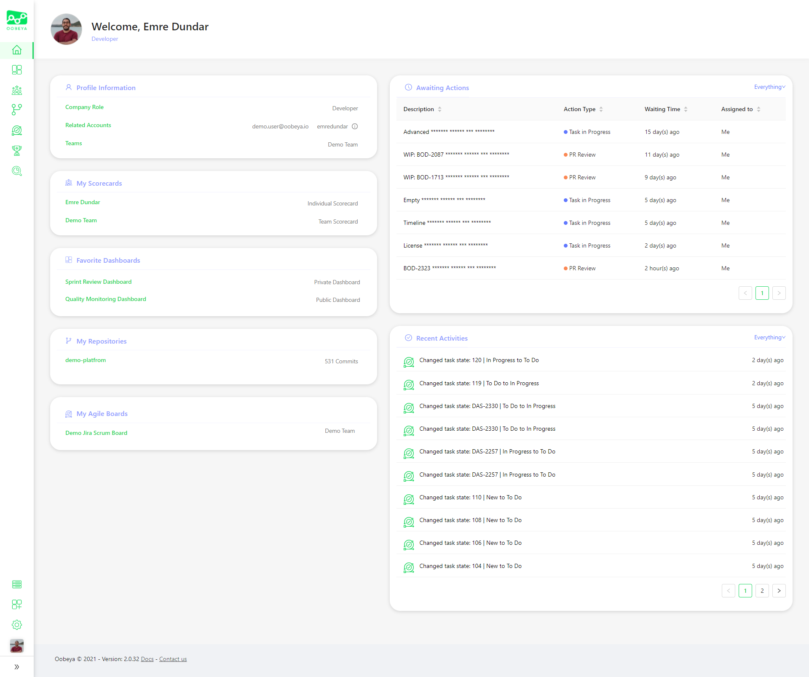
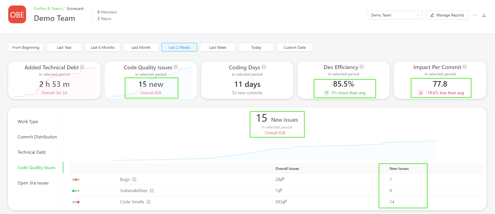
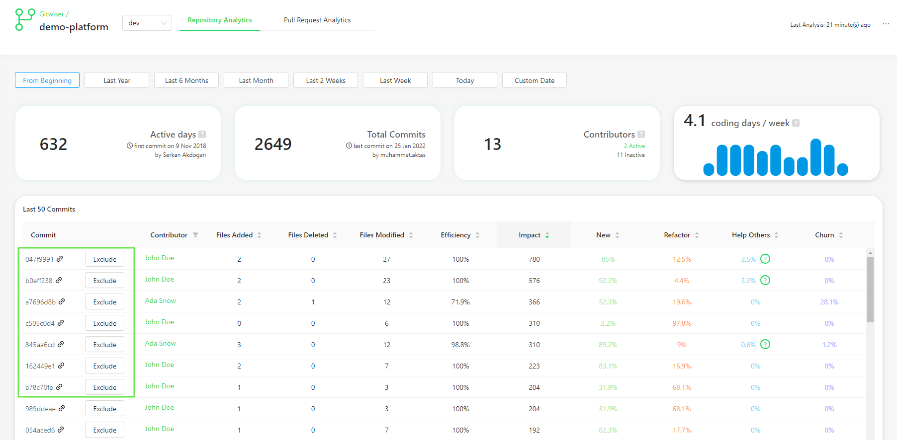
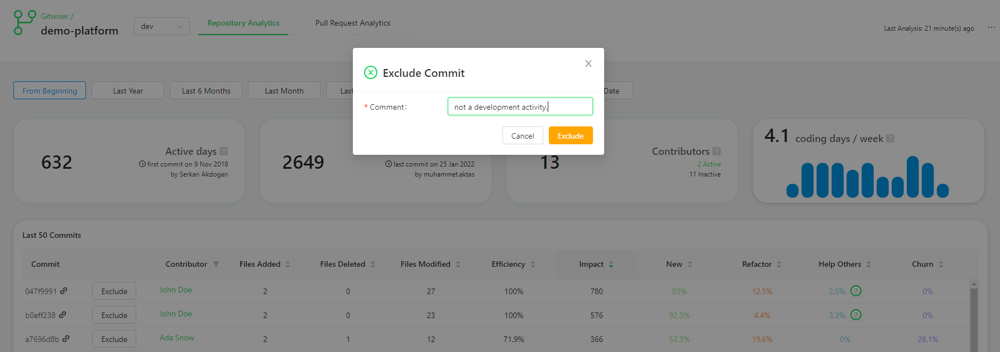
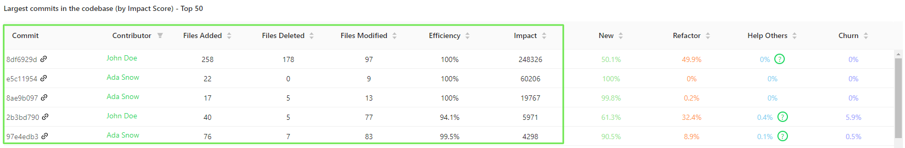
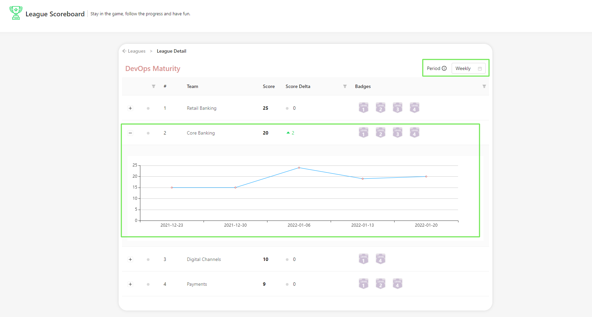

# 🎁 Oobeya Jan 2022 Updates

:tada: We are excited to introduce our new features and improvements.

### Personalized Homepage

We have added a new **personalized homepage** to enhance the user experience and help you navigate easily to your Scorecards, repository and agile board analytics in Oobeya. You can also see a list of your **awaiting actions** on your homepage and take action to resolve them.

Personalized Homepage includes:

* Basic profile info (Company role, related accounts and teams of the user)
* Individual and Team Scorecards of the user
* List of favorite dashboards of the user
* List of repositories (Gitwiser analysis) of the user
* List of agile boards (AgileSpace analysis) of the user
* **Awaiting Actions** of the user (tasks in progress, awaiting Pull Request reviews and submits)
* **Recent Activities** timeline (commits, pull requests, project management activities...)

### Scorecards

#### UI/UX improvements on Scorecards

We have made UI/UX improvements on Individual and Team Scorecards. New improvements include:

* Added a historical timeline on code quality summary cards.
* Redesigned the summary cards to show the delta and overall values in detail.
* Redesigned the code quality tabs to show the delta and overall values in detail.

#### Pull Requests - Work In Progress

Now you can see the **open pull requests of teams** with PR risk labels (overdue, stale, oversized) in your Scorecards so you can efficiently pinpoint the bottlenecks of your code review cycle. Starting in February, we will be providing more metrics about pull requests.&#x20;

**Note:** In order to see the data on the scorecards, you should perform pull request analysis for your repositories via Gitwiser.

.png>)

### Gitwiser

#### Exclude Commits

In Gitwiser you can now exclude commits from analysis results to remove misleading data.

You should enter a reason for the exclusion. Starting in February, you will be able to see the excluded commits along with the exclusion reasons and easily include them in the analysis.

#### The largest commits in the codebase (by impact score)

In Gitwiser repository analysis now you can see a list of the largest commits of your codebase. With this list, you can effortlessly explore the largest development activities and detect outliers to exclude from the analysis.

### Leagues

We have started making improvements to Leagues in Oobeya's gamification module. You can see a scoring timeline for each team on the League Leaderboard page.

