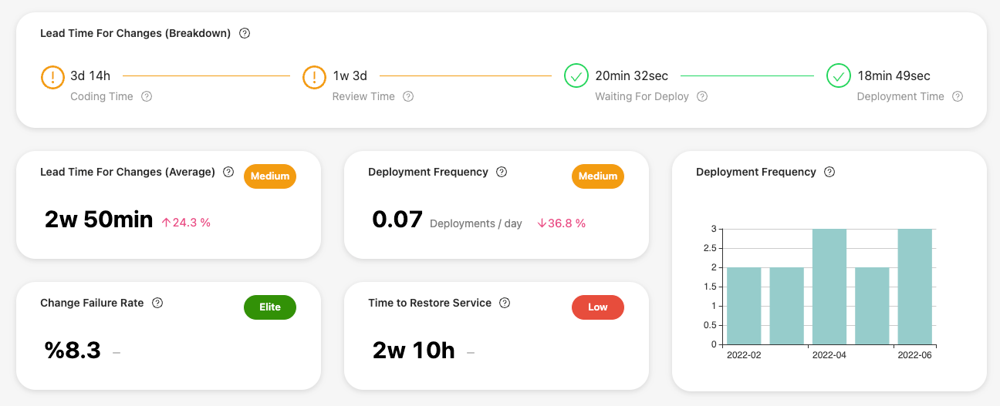

# 🎁 Oobeya July 2022 Updates

## Summary

&#x20;:tada: We are super excited to share our new features and improvements with you!

* [x] GitHub Enterprise Server integration is ready!
* [x] Oobeya Team Scorecards now display all DORA Metrics!
* [x] DORA Metrics widgets now have a date range comparison feature! (Last 7 days vs. Previous 7 days)
* [x] Oobeya Agile Board Analytics module has a date range comparison feature!
* [x] Oobeya Agile Sprint Reports has a new comparison feature! (Sprint 25 vs. Last 10 Sprints Avg)
* [x] UI/UX & performance improvements!

## ​🎁 NEW FEATURES

### GitHub Enterprise Server integration is ready!

We’re excited to announce that Oobeya now integrates with GitHub Enterprise Server! This new addon is available in our marketplace, and we’ve created a quick start guide to help you get started.

.png>)

This integration enables Oobeya to be used with GitHub Enterprise Server, in addition to our already existing [GitHub](https://docs.oobeya.io/integrations/scm-addons/github-integrations) and [GitHub Enterprise Cloud](https://docs.oobeya.io/integrations/scm-addons/github-integrations) integrations.

[GitHub Enterprise Server](https://docs.github.com/en/enterprise-server@3.5/admin/overview/about-github-enterprise-server) is the on-premises version of [GitHub](https://github.com/), and we’re thrilled to offer this new integration to our users. With this new addon, you can easily connect [Oobeya](https://oobeya.io/integrations/) to your GitHub Enterprise Server instance.


:bulb: Read more on Oobeya Blog: [GitHub Enterprise Server Integration Is Ready!](https://oobeya.io/blog/github-enterprise-server-integration-is-ready/)-


How Does Oobeya GitHub Integration Work?

Oobeya GitHub addon collects and analyzes data/activities/signals from GitHub and makes sense of them in multiple dimensions (individual, team, organization, system). It provides actionable insights to software engineering teams and leaders.&#x20;

This integration works with the following Oobeya analytics modules:

1. Git Repository Analytics **(Software Development Process)**
2. Pull Requests Analytics **(Code Review Process)**
3. Deployment Analytics – DORA Metrics **(Software Delivery Process)** (works with GitHub Actions, Jenkins, Azure DevOps, GitLabCI, TeamCity)

See the Software Engineering Metrics that Oobeya delivers [here](https://oobeya.io/oobeya-metric-definitions/).


_**Oobeya Deployment Analytics**_ works with [GitLab CI](../../integrations/all-integrations/scm-addons/gitlab-addon.md), [AzureDevOps](../../integrations/all-integrations/scm-addons/azure-devops-integration.md), [Jenkins](../../integrations/all-integrations/scm-addons/jenkins-integration.md), and [GitHub Actions](../../integrations/all-integrations/scm-addons/github-integrations.md) for now.&#x20;

Coming soon: _Spinnaker, BB Pipelines, Octopus, PagerDuty, OpsGenie, ServiceNow,_ and more...


### Oobeya Team Scorecards now display all DORA Metrics!

Oobeya Team Scorecards now display all four DORA Metrics: Lead Time For Changes, Deployment Frequency, Change/Failure Rate, and Time To Restore Service!

This means that teams can now track their progress against each of these important engineering metrics, and identify areas where they may need to focus their improvement efforts.

You can also drill down into each metric to see how your teams are doing. This is a great way to stay on top of your team's delivery performance and make sure that you're always improving.

We hope that this new feature will help teams to better understand their performance and continue to drive quality improvements in their engineering processes.

### DORA Metrics widgets now have a date range comparison feature!

DORA Metrics widgets now have a date range comparison feature! This means that you can now compare your current performance against a previous time period, and see how you're progressing. (for example, Last 7 days vs. Previous 7 days)

This new feature allows you to benchmark your progress and compare it against a date range of your choosing. This is a great tool for continuous improvement.&#x20;

We hope you find this new feature helpful!

### Oobeya Agile Board Analytics module has a date range comparison feature!

Oobeya Agile Board Analytics module has a date range comparison feature! This new feature will allow agile team members to compare the agile metrics across different time periods. This will help with continuous improvement by allowing Scrum Masters and Product Owners to see where their team's sprint success has improved or worsened.

.png>)

### Oobeya Agile Sprint Reports has a new comparison feature!&#x20;

The Oobeya Agile Sprint Reports has a new comparison feature! This new feature will allow Product Owners to compare their sprint success against other sprints and benchmark their progress. This will help ensure that Product Owners are always aware of their sprint progress and can make necessary adjustments to ensure sprint success.

To use the comparison feature, simply select the sprints that you want to compare from the drop-down menu. You will then see the comparison of the selected sprints. This will allow you to quickly see how your team is progressing.

We hope that you find this new feature helpful in achieving your sprint goals.

.png>)

## :muscle: IMPROVEMENTS

* \[Gitwiser] Do not analyze a commit if it has already been analyzed in another branch analysis.
* \[Gitwiser] Allow limiting Gitwiser analysis by date to improve analysis performance.
* Performance improvements
* UI/UX improvements

## :person\_running: SEE OOBEYA IN ACTION!


Do you want to see all the new features in action and talk about the product roadmap?

Click and [**book a demo**](https://oobeya.io/schedule-a-new-demo/?utm_source=releasenotes\&utm_medium=june2022) now.


